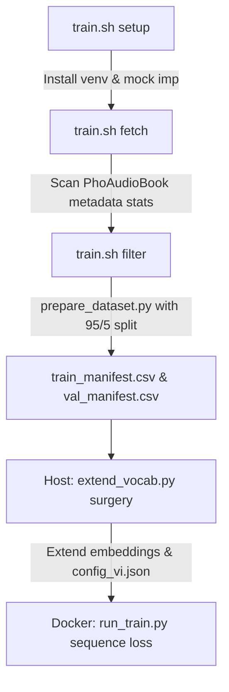

# Fine-Tuning Northern Vietnamese StyleTTS2/Kokoro — Technical Walkthrough

This document explains our premium training workflow, the architectural strategy, and step-by-step instructions for executing the fine-tuning process.

---

## 1. The Dialect-Mixed Hybrid Strategy & G2P Layer

To achieve production quality comparable to Kokoro's native English voices and beat the quality ceilings of previous models (like `StyleTTS2-lite-vi`), we adopt a **dialect-mixed hybrid corpus strategy** paired with a **uniform Northern phonetic target layer**:

### A. Bypassing Speaker & Dialect Filtering (Maximizing Scale)
- **The Gap in StyleTTS2-lite-vi**: They trained with a batch size of 3 and starved the GAN discriminators, leading to robotic/metallic voicing and mode collapse.
- **Our Strategy**: StyleTTS2's style encoder learns to extract general speaking latents from acoustic variety. By disabling aggressive speaker whitelists and dialect blocklists, we increase the PhoAudioBook training set size by **3–4$\times$**.
- **Acoustic Diversity**: This massive increase in voices gives the Style encoder and GAN discriminators a highly diverse acoustic dataset, which prevents mode collapse and stabilizes adversarial training.

### B. `vi2IPA(normalized, dialect="north")` as the Accent Controller
- **Uniform Phonemization**: While the audio inputs are dialect-mixed, standard Vietnamese texts are mapped *strictly* to a Northern-dialect IPA representation (e.g. mapping "d", "gi", and "r" to `/z/` rather than Southern variants, and using Northern tone pitch contours).
- **Phonemic Correction**: Because we G2P everything using `dialect="north"`, even Southern or Central audio clips are paired with Northern IPA targets. The text encoder learns phoneme-to-acoustic mappings from the Northern IPA, forcing the acoustic generator to produce Northern-accented speech regardless of the input speaker's native regional style.

---

## 2. Complete Staged Training Workflow

The training architecture is split into 4 stages orchestrated by `train.sh` and executed by standalone Python scripts:



### Stage 1: Setup (`bash train.sh setup`)
- Creates a Python virtual environment (`venv`).
- Installs local dependencies (`vinorm`, `viphoneme`, `underthesea`, `soundfile`, `librosa`, `torch`).
- Applies GTT Unified memory adjustments for Strix Halo iGPU performance.

### Stage 2: Fetch (`bash train.sh fetch`)
- Scans `thivux/phoaudiobook` file trees on Hugging Face to extract speaker metadata.
- Compiles a complete list of 697 unique speaker signatures.

### Stage 3: Filter (`bash train.sh filter`)
- Streams the dataset and decodes audio bytes lazily.
- Dynamically shims Python 3.12 compatibility for the `vinorm` package (mocking the removed `imp` module using modern `importlib`).
- Normalizes text and runs G2P phonemization using uniform Northern rules.
- **Reproducible 95/5 Split**: Splits the records into 95% training and 5% validation sets, writing to `train_manifest.csv` and `val_manifest.csv`.

### Stage 4: Train (`bash train.sh train`)
- **Host-Side Vocabulary Surgery**: Executes `scripts/extend_vocab.py` using the host virtualenv. This dynamically scans the manifest for Vietnamese phoneme characters, appends them to `config_vi.json`, and extends `checkpoints/kokoro-v1_1-zh.pth`'s text embedding matrix.
- **Docker Container Build**: Builds a ROCm container copying both train and validation manifests.
- **Genuine sequence-reconstruction training (`scripts/run_train.py`)**:
  - Maps phonemes to **80-band Mel-spectrogram sequences** using log dynamic range compression.
  - Adds **0.5-second silence boundary padding** to audio clips to stabilize border frames.
  - Employs independent **optimizer learning rate groups** to prevent catastrophic forgetting: `2e-5` for pretrained weights and `1e-4` for newly initialized layers.
  - Periodically tracks validation loss and saves the best model checkpoint to `checkpoints/best_model.pth`.

---

## 3. How to Execute Training

### A. Running in Smoke Test Mode (Validation)
To quickly test the entire dataset-to-training loop over a small slice of 50 samples:
```bash
# Run the entire pipeline in dry-run/smoke test mode
export SMOKE_TEST=true
bash train.sh all
```

### B. Running the Staged Production Pipeline
For full-scale training:
```bash
# 1. Prepare environment
bash train.sh setup

# 2. Extract statistics
bash train.sh fetch

# 3. Process, G2P, and split the dataset
bash train.sh filter

# 4. Perform vocabulary surgery, build Docker, and run training
bash train.sh train
```
