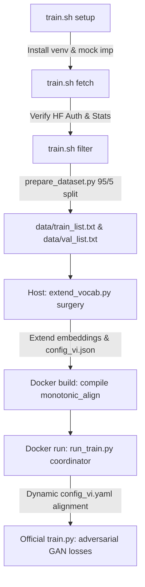

# Fine-Tuning Northern Vietnamese StyleTTS2/Kokoro — Technical Walkthrough (V3)

This technical walkthrough documents the V3 fine-tuning pipeline for the Northern Vietnamese KokoroTTS / StyleTTS2 model. It covers the architectural design, hybrid dialect controllers, vocabulary surgery, and GPU-accelerated training orchestration.

---

## 1. Core Architectural & Phonetic Strategy

To achieve premium naturalness, expressiveness, and dialect isolation, our V3 pipeline implements a **dialect-mixed hybrid corpus strategy** paired with a **uniform Northern phonetic target layer** and **strict speaker-stratification**:

```
                                    +-----------------------+
                                    |   PhoAudioBook Dataset|
                                    +-----------+-----------+
                                                |
                                                v
                                    +-----------+-----------+
                                    |   Dialect Auditor &   |
                                    |   DNSMOS ONNX Quality |
                                    +-----------+-----------+
                                                |
                                                v
                              +-----------------+-----------------+
                              |                                   |
                              v (Northern Dialect Text)           v (Southern/Central Text)
                      +-------+-------+                   +-------+-------+
                      |   G2P (North) |                   |   G2P (South) |
                      +-------+-------+                   +-------+-------+
                              |                                   |
                              +-----------------+-----------------+
                                                |
                                                v
                                    +-----------+-----------+
                                    |Speaker-Stratified Split|
                                    +-----------+-----------+
```

### A. Perceptual Quality Gating (DNSMOS ONNX)
- Audio clips are downmixed to mono, resampled to 24 kHz, and normalized to exactly `-23.0 LUFS` to standardise loudness.
- Post-normalization clipping checks filter out distorted or clipped audio.
- The pipeline integrates the official **Microsoft DNSMOS ONNX** model (`dnsmos_p835.onnx`) to perform deep perceptual acoustic analysis, discarding any clip with an overall Mean Opinion Score (MOS) below `3.5`. This keeps background noise, hums, and room reverberations out of training.

### B. Dynamic Dialect Auditing & Classification
- Text transcripts are audited for Southern and Central regional lexical items (like *vầy*, *hổng*, *chi*, *mô*). Obvious dialect mismatches are immediately discarded.
- A **Wav2Vec2-based Dialect Classifier** (`wav2vec2-base-vi-accent-classification`) is employed on-the-fly with confidence gating (`AUDIT_CONFIDENCE = 0.85`).
- The auditor votes across 6 spread audio samples for each speaker to lock their dialect class (`north`, `south`, `central`, or `mixed`). `mixed` speakers are automatically excluded to preserve phonetic purity.
- If a speaker's locked accent is not Northern and the pipeline is in Northern-only mode, the speaker is filtered out. If the pipeline is running in multi-dialect mode, the G2P layer dynamically adjusts to use dialect-specific rules (`vi2IPA(text, dialect=locked)`).

### C. True Speaker-Stratified Split (Zero Leakage)
- Naive random train/val splitting causes severe **speaker leakage** (clips from the same speaker appear in both the training set and the validation set), causing overfit and invalid evaluation scores.
- V3 implements **speaker stratification**: clips are grouped by speaker, and the 95% training / 5% validation split is applied *within* each speaker. This ensures that the validation set is a true indicator of generalization.

---

## 2. Complete Staged Training Workflow

The pipeline is coordinated by the root `train.sh` orchestrator and executed via optimized modular Python scripts:



### Stage 1: System Setup (`bash train.sh setup`)
- Builds the local Python virtual environment (`venv`).
- Installs all local dependencies (`transformers`, `onnxruntime`, `viphoneme`, `datasets`, etc.) along with the correct **AMD ROCm 6.2 enabled PyTorch wheels**.
- Configures **AMD Unified Memory GTT size** (`gttsize = 96 GB`) in `/sys/module/amdgpu/parameters/gttsize` for the Strix Halo iGPU to maximize memory performance and eliminate PCIe bus transfer latency.

### Stage 2: Fetch Metadata (`bash train.sh fetch`)
- Verifies Hugging Face authentication to prevent middle-run login blockers.
- Uses `get_unique_speakers.py` with multi-threading to extract unique speakers by reading Parquet row-group statistics, bypassing the download of actual audio waves to save massive bandwidth.

### Stage 3: Dataset Prep (`bash train.sh filter`)
- Streams `thivux/phoaudiobook` from Hugging Face and processes audio via G2P.
- **Double Manifest Output**:
  1. Writes standard **4-column pipe-delimited CSV manifests** (`wav|ipa|text|speaker_id`) for user reference, analysis, and auditing.
  2. Writes clean **2-column pipe-delimited TXT manifests** (`wav|ipa`) inside `data/train_list.txt` and `data/val_list.txt`. This exactly matches StyleTTS2-lite's `FilePathDataset` loader to prevent any positional argument unpack crashes.

### Stage 4: Vocab Surgery & Docker Run (`bash train.sh train`)
- **Phonetically Correct Vocab Surgery**: `extend_vocab.py` extracts phonetic tokens from the manifest using grapheme clusters (`regex.findall(r"\X", text)`), keeping multi-codepoint IPA tokens (like Chao tone markers `˧˩˨`) intact.
- **Embedding Surgery**: Extends the text embedding weights using the **Centroid Mean + Tiny Normal Perturbation** strategy. This stabilizes gradient updates and prevents catastrophic forgetting.
- **Dockerfile Build**: Builds the ROCm container, installs NumPy and Cython first, and **compiles `monotonic_align` cython extension in-place** inside the image, resolving runtime import errors.
- **V3 Training Coordinator**: `run_train.py` dynamically loads the extended `config_vi.json`, generates a compatible `config_vi.yaml`, **mathematically aligns** the symbol list order to match embedding rows, and launches `/opt/StyleTTS2/train.py` from `/opt/StyleTTS2` as the current working directory.
- **Joint Training Engine**: StyleTTS2's official script manages:
  - GPU-accelerated JDCNet `pitch_extractor` and log normal energy extraction.
  - Monotonic Alignment Search (MAS) inside the alignment block.
  - Discriminator updates (`msd`, `mpd`) and generator training loops with adversarial and feature losses.

---

## 3. How to Execute Training

### A. Run a Fast smoke-test (Validation)
To verify the entire pipeline, build the Docker container, run embedding surgery, compile cython modules, and train for 30 steps:
```bash
bash train.sh --smoke-test
```

### B. Run Production Training
To execute the complete high-fidelity pipeline on your Strix Halo APU:
```bash
# Run everything sequentially
bash train.sh
```

Or execute stage-by-stage:
```bash
# Stage 1: Setup virtualenv and system parameters
bash train.sh --stage setup

# Stage 2: Fetch Parquet file stats
bash train.sh --stage fetch

# Stage 3: Perceptual filter and partition dataset
bash train.sh --stage filter

# Stage 4: Vocab surgery, Docker compile, and run training
bash train.sh --stage train
```
