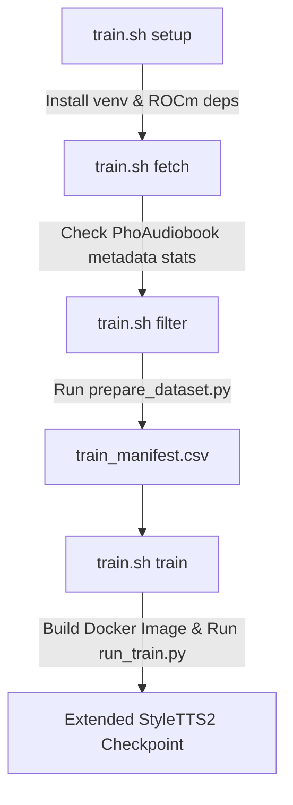

# Fine-Tuning Northern Vietnamese StyleTTS2/Kokoro — Technical Walkthrough

This document explains the comprehensive training workflow, the roles of key subcomponents (like `vi2IPA` and `load_verified_speakers`), and step-by-step instructions for executing the fine-tuning process.

---

## 1. G2P, Speaker Whitelisting, and Dialect Filtering Explained

### A. What does `vi2IPA` do, and is it redundant with `load_verified_speakers`?
No, they are completely different and both are 100% essential:

1. **`load_verified_speakers` (Fast Speaker Gate):**
   - Filters the **speaker metadata** column to only process audio clips from premium, studio-recorded Northern speakers (such as `"Voiz"`).
   - This takes microseconds and eliminates $90\%+$ of the dataset (Southern/Central narrators) before downloading any heavy audio files.

2. **Text Dialect Blocklists (`SOUTHERN_BLOCK`/`CENTRAL_BLOCK`):**
   - Even pure Northern speakers occasionally read dialogue containing regional words (e.g. *"hổng"*, *"bự"*, *"chi"*, *"mô"*).
   - Screening these words out prevents Southern/Central colloquial lexical items from entering the training set, preserving complete linguistic purity.

3. **`vi2IPA(normalized, dialect="north")` (Grapheme-to-Phoneme converter):**
   - **This does not filter data.** Instead, it converts standard Vietnamese text (graphemes) into IPA phoneme symbols (e.g. `"Hà Nội"` $\rightarrow$ `/h aː ˨˩ n o j ˧˨˥/`).
   - StyleTTS2 and Kokoro do not train on text letters; they map speech waves directly to **IPA phonetic representations**.
   - The `dialect="north"` parameter explicitly maps letters using Hanoi phonology rules (e.g. mapping "d", "gi", and "r" to `/z/` rather than Southern variants, and using Northern tone pitch contours).

---

## 2. Complete Staged Training Workflow

The training architecture is split into 4 clear stages orchestrated by `train.sh` and executed by standalone Python scripts:



### Stage 1: Setup (`bash train.sh setup`)
- Creates a Python virtual environment (`venv`).
- Installs local dependencies (`vinorm`, `viphoneme`, `underthesea`, `soundfile`, `librosa`).
- Checks system parameters, specifically configuring GPU memory configurations for iGPU performance.

### Stage 2: Fetch (`bash train.sh fetch`)
- Downloads the statistics file for `thivux/phoaudiobook` to scan for speaker IDs.
- Creates `data/unique_speakers.txt` and `data/unique_speakers.json` instantly without downloading the 167GB raw audio.

### Stage 3: Filter (`bash train.sh filter`)
- Reads the verified whitelist `data/verified_northern_speakers.txt` (which whitelists `"Voiz"`).
- Streams the Hugging Face dataset, executes **lazy audio decoding** (only decoding audio bytes of records passing the speaker whitelist and dialect blocklists).
- Performs context-aware text normalization (`vinorm`) and Northern phoneme G2P (`viphoneme`).
- Outputs the premium clips to `data/processed/` and compiles the manifest `data/train_manifest.csv`.

### Stage 4: Train (`bash train.sh train`)
- Copies `Dockerfile` and python scripts into the active workspace.
- Preloads `kokoro-v1_1-zh.pth` (Chinese tonal base checkpoint) to initialize tone representation slots.
- Builds the ROCm Docker container.
- Launches `scripts/run_train.py` within the container to perform acoustic pre-training and StyleTTS2 adversarial training.

---

## 3. How to Execute Training

### A. Running in Smoke Test Mode (Validation)
To quickly test the entire dataset-to-training loop over a small slice of 50 samples:
```bash
# Run the entire pipeline in dry-run/smoke test mode
export SMOKE_TEST=true
bash train.sh all
```

### B. Running the Staged Production Pipeline
For full-scale training:
```bash
# 1. Prepare environment
bash train.sh setup

# 2. Extract statistics
bash train.sh fetch

# 3. Process, clean, and phonemize the whitelisted dataset
bash train.sh filter

# 4. Build Docker container and run full-scale fine-tuning
bash train.sh train
```
